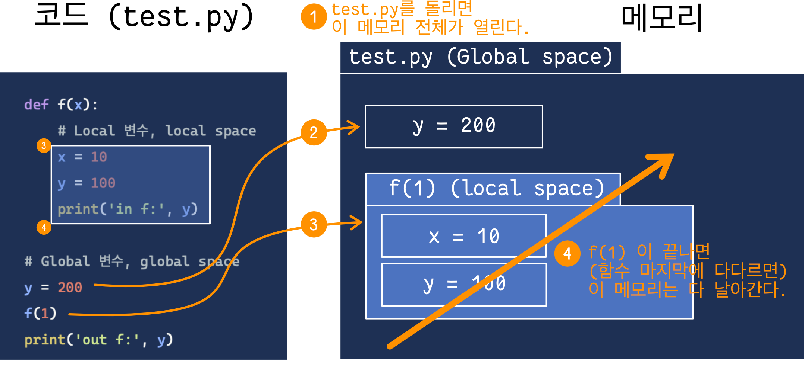

# Day 06: 함수 2, Big-O

- 함수 2
    - Name space
    - Global 변수, Local 변수
- Big-O Notation    


## 함수 2

### Namespace

- 변수 (이름) 의 효력 범위 (???)
- 이게 무슨 말이냐면, 어떤 변수가 **코드 중 어느 공간**에서 쓰일 수 있는지 / **어느 공간에서 접근 가능한지** 를 나타내는 **변수의 활동 공간**을 말함.
- 활동공간을 함수 내부 / 외부 이렇게 구분할 수도 있지만, 메모리 상에서 글로벌 영역 / 로컬 영역 이렇게 생각할 수도 있다. (같은 것을 다른 관점으로 해석하는 것일 뿐)
- 예)
    ```python
    
    def f(x):
        x = x + 1
        return x
    
    y = 3
    ```
    - 위의 예시에서
      - y의 활동 공간은 가장 밖 공간 (global 한 공간) 이고
      - x의 활동 공간은 f 함수 내부 (local 한 공간) 이다.
    - 그래서 우리는
      - y 의 namespace는 global space 라고 부르고
      - x 의 namespace는 f 내부라고 부른다.
- 변수의 namespace 를 왜 (굳이) 알아야 하는가?
    - 변수가 은근히 같은 이름이 여러 번 나오기 때문. 인간의 작명 창의성의 한계에 의해.. 꽤 많은 경우 동명이인(?) 변수, 즉 같은 이름을 가진 다른 변수가 생기게 마련임. 
    - 이 때, 누가 누구인지를 구별해주기 위해 namespace 를 잘 알아야 함.

### Global 변수 vs Local 변수

- Global 변수: Global namespace 에서 접근 가능한 변수

- Local 변수: Local namespace 에서 접근 가능한 변수

- 예)
    ```python
    
    def f(x):
        x = x + 1
        return x
    
    y = 3
    ```
    위의 예시에서
    
    - x 는 (f 내의) local 변수
    - y 는 global 변수

### 변수의 수명 (Variable lifetime)

- 변수의 삶과 죽음
    - 변수가 살아있다 == 메모리 안에 존재한다
    - 변수가 죽었다 == 메모리에서 날아가버렸다 (메모리에 더 이상 존재하지 않는다)
- 변수의 탄생과 죽음
    - 변수의 탄생 시점 == 변수가 처음으로 정의되는 시점
    - 변수의 죽음 시점 == 메모리에서 날아가버리는 시점
- 변수의 삶과 죽음을 왜 (굳이) 알아야 하는가?
    - 변수를 저장하는 메모리가 무한대가 아니기때문에 변수는 죽게 마련이다. 
    - 죽어버린 변수는 더 이상 쓸 수 없기 때문에, 변수가 언제 생명을 다하는지 잘 알아야 내가 원하는대로 잘 돌아가는 코드를 만들 수 있다.

- 변수의 namespace 와 lifetime 예시

  ```python
  """
  File 명: test.py
  """
  
  def f(x):
      # Local 변수, local space
      x = 10 
      y = 100
      print('in f:', y)
  
  # Global 변수, global space
  y = 200
  f(1)
  print('out f:', y)
  ```

  실행 결과

  ```
  in f: 100
  out f: 200
  ```

  <br><br>

  

  

## Big-O (빅오) Notation

- Time Complexity 표시
    - Big-O notation을 사용하여, 코드의 시간이 인풋 크기 대비 (최대 / 최악의 경우) 얼마나 오래 걸리는지를 표시할 수 있다.
- Space complexity 표시 
    - Big-O notation을 사용하여, 코드가 사용하는 메모리 소모량이 인풋 크기 대비 (최대 / 최악의 경우) 얼마나 많이 소모되는지를 표시할 수 있다.
- Big-O notation 왜 쓰느냐?
    - 데이터 사이즈가 클 때, 시간이 대략 얼마나 걸릴지 알아보기 위해 주로 씀.
    - 예를 들어, 내가 총 다뤄줘야하는 인풋 데이터가 100이라고 하자. 이 때, 100을 다 돌리는 데에 / 다루는 데에 걸리는 시간이 어느정도 될지 대략 예측해보기위해 
        - 인풋 데이터 조금 잘라서 (샘플링해서) 한 1 정도로 줄이고 
        - 작은 데이터에서 시간이 얼마나 걸리는지 측정한 뒤
        - Big-O notation을 기반으로 하여 100일때는 최종 시간이 얼마나 걸릴지 생각해본다.
- Big-O notation 표기법
    - 인풋 크기를 `n` 이라고 하면, 
        - ex) 리스트의 크기가 n = 10, 20, 30, ... 이라고 하면
    - Time (space) complexity를 O(log n), O(n), O(n<sup>2</sup>), 이런 식으로 표기한다.
    - 퉁치기: 자잘한 term들은 생략한다.
        - `coefficient 무시`
            - n이나 2n이나 앞에 상수가 곱해진건 그냥 무시. 기울기는 관심 없다. 데이터 크기가 증가함에따라 시간이 어떠한 트렌드로 변하는지 (linear 한지, exponential한지 등등) 에 주로 관심이 있기 때문
                - O(n), O(2n), O(0.001 n) == O(n)
                - O(n<sup>2</sup>), O(50 n<sup>2</sup>) == O(n<sup>2</sup>)
        - `작은 term 무시`
            - O(n), O(2n), O(3n + 4) ==> O(n)
            - O(3n<sup>2</sup> + 100000n) ==> O(n<sup>2</sup>)
                - 3n^2 에 비하면 100000 n 은 너무 미미하다. 그래서 100000 n 따위는 무시
- 예) Linear search vs. Binary Search (10)
    - Sorting 된 리스트 `lst = ['an', 'bear', 'bravo', ..., 'zen']` 에서 `lst`안에 `'hello'` 가 있는지 찾는 문제가 있다고 해보자. 이 때, `lst`의 길이를 `n` 이라고 하자 (즉, 인풋 크기 = n).
    - Linear search
        - 앞에서부터 하나씩 일일이 확인해보는 방법.
        - O(n): 최대 n 시간 걸린다 (재수 없으면 끝까지 봐야함)
    - Binary search
        - 예시) 소주 술게임 업다운
        - O(log n): 내가 봐야할 문제 사이즈가 반씩 계속 줄어들기때문에 최종 O(log n). 

