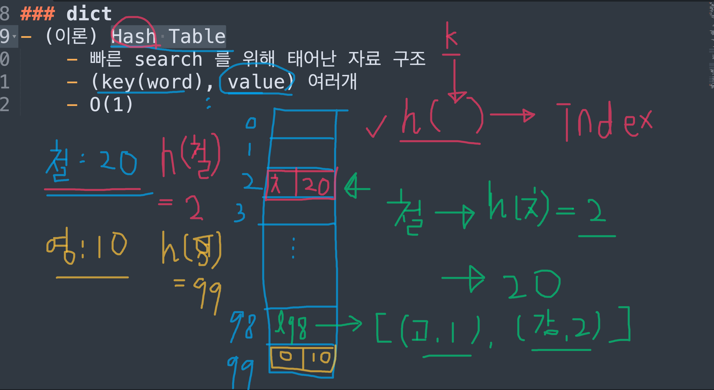
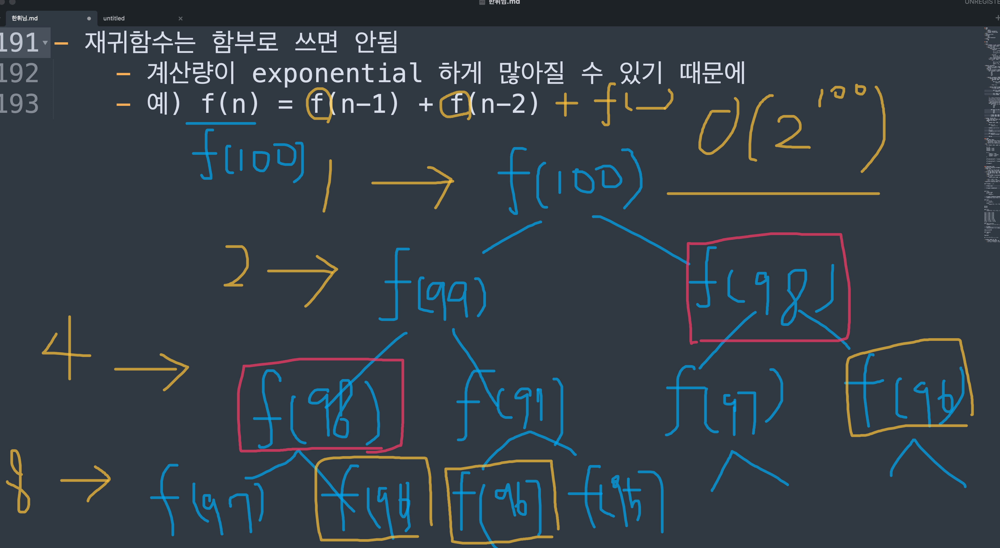
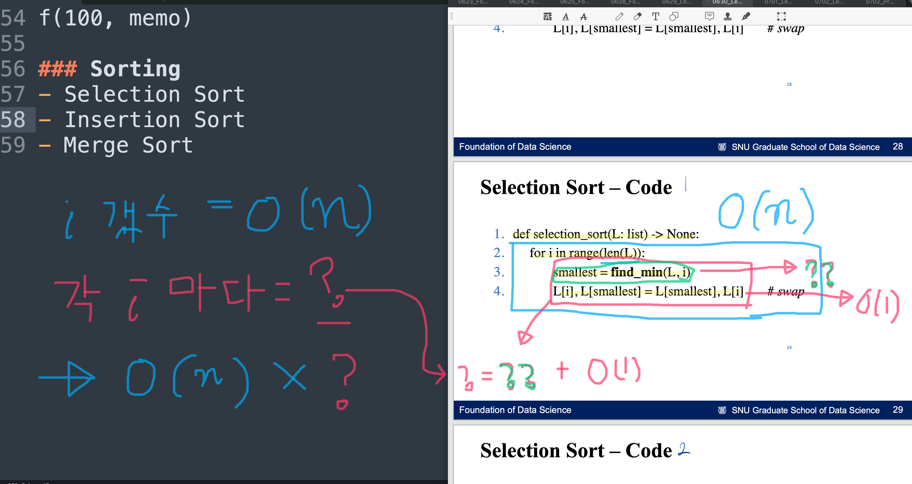
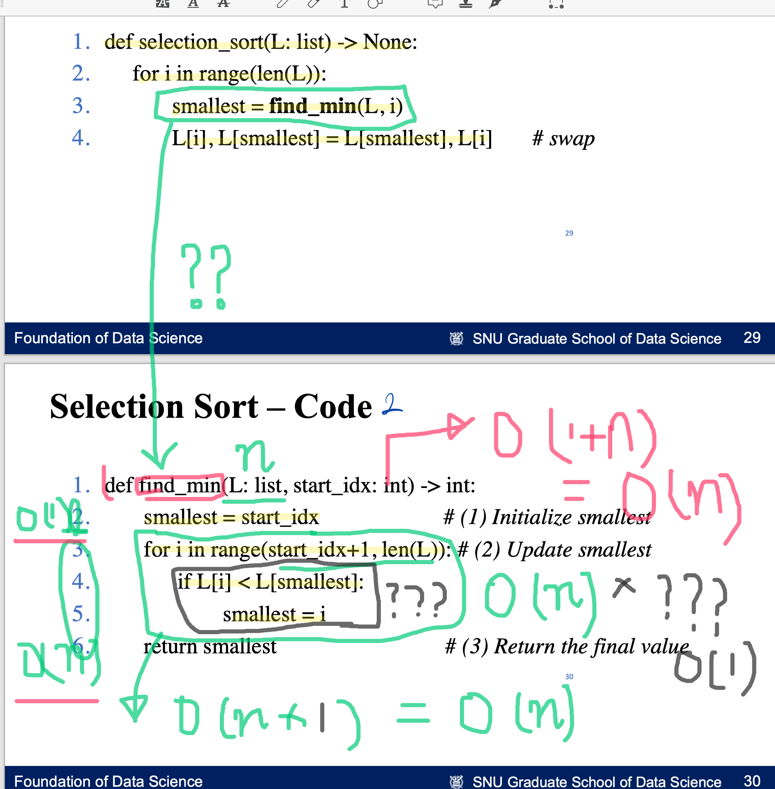
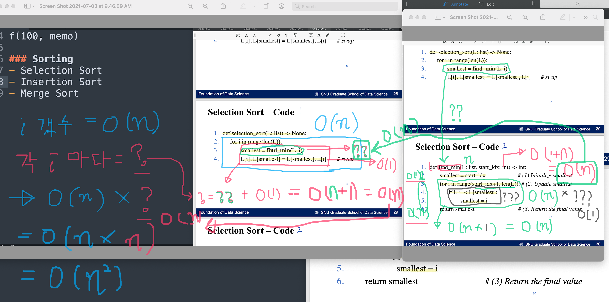

## 오늘

- 보충
    - tuple
    - default parameter
    - lambda: 이름 없는 함수
- Dictionary (dict)
- Recursion (재귀)
- Sorting


## 보충

### tuple

- **여러가지** 원소를 **순서대로** 배열한 데이터

- tuple 만들기

    - 소괄호로 열고 닫고, 그 안에 데이터들을 순서대로 콤마(,)로 구분하여 나열
    - `(원소1, 원소2, 원소3, ... )`

- tuple vs list
    - 비슷한 점: tuple 이랑 list 는 굉장히 비슷해서 웬만한 연산은 둘 다 똑같이 사용 가능
        - indexing
            
            ``` python
            tp = ('a', 'b', 'c')
            print(tp[-1])
            ```
            
            실행 결과
            
            ```
            'c'
            ```
            
        - slicing
            
            ```python
            tp = ('a', 'b', 'c', 'd')
            print(tp[1:])
            ```
            
            실행 결과
            
            ```
            ('b', 'c', 'd')
            ```
        
    - 다른 점
        
        - tuple 은 수정이 불가하고 (read-only, immutable)
            
        - list 는 수정이 가능 (write 가능, mutable)
            
        - 예)
        
            ```python
            tp = ('a', 'b', 'c')
            tp[0] = 'A'
            ```
        
            실행 결과: 에러 뜸. tuple 에는 item assignment (아이템 / 원소 수정) 안된다는 뜻
        
        
            ```
            Traceback (most recent call last):
              File "<stdin>", line 1, in <module>
            TypeError: 'tuple' object does not support item assignment

### Default parameter

- parameter == 함수의 인풋변수

- default parameter == 함수의 인풋변수 중에서 default 값을 가지는 애들

- default parameter 설정하는 방법
    
    ```python
    def f(input1, input2=default2, ...):
        ...
    ```

    위에서 input2 라는 변수는 default2 라는 기본값 (default 값) 을 갖게 된다.
    
- default parameter 사용하는 방법
    - default 값을 쓰는 경우
        - default parameter에 값을 주지 않으면 알아서 default 값으로 사용 됨
        
        - 예)
            
            ```python
            def f(x, y=0):
                return x + y
            
            output = f(1)
            print(output)
            ```
            
            실행 결과
            
            ```
            1
            ```
        
    - default 값을 쓰지 않는 경우
        - (default) parameter에 내가 원하는 값을 주면, 내가 준 값이 인풋 변수에 들어감
    
        - 방법1) 기존에 default parameter 배우기 전에 하던 것 처럼, 그냥 인풋 변수의 순서에 맞게 값을 주거나
        
        - 방법2) `특정 변수 이름 = 내가 원하는 값` 의 형식으로, 변수 이름을 콕 찝어 값을 줘도 된다. 이 때의 변수를 keyword argument 라고 부르기도 한다. 다른 말로 하면, 함수를 call 할 때 인풋 변수의 이름이 명시적으로 쓰인 경우, 그 인풋 변수를 keyword argument 라고 한다.
        
            - 방법 2) 는 왜 생겼을까?
            
                - (뇌피셜) Default parameter 가 엄청 많은 함수인 경우, 맨 끝에 있는 default parameter 만 값을 설정하고싶고 나머지 앞쪽 default parameter 들은 그냥 기본값을 쓰고싶다고 해보자. 이 경우, 인풋 값을 줄 때 변수 순서대로 주는 방법밖에 모른다면, 맨 끝 parameter 만 값을 따로 설정하고싶음에도 불구하고 앞에 있는 모든 다른 paramter 까지 값을 설정해줘야한다. 즉 비효율적.
                
                - 예) 
                
                    ```python
                    def PCA(n_components=None, *, copy=True, whiten=False, svd_solver='auto', tol=0.0, iterated_power='auto', random_state=None):
                        ...
                    ```
                    
                    위와 같이 PCA 라는 함수를 쓰고 싶다고 해보자. default parameter가 정말 많다. 맨 마지막 인풋 변수 random_state 만 값을 따로 지정하고싶을 때 제일 효율적인 방법은 `방법 2) keyword argument` 를 사용하는 것이다.
                    
                    ```python
                    PCA(random_state=어쩌고저쩌고)
                    ```
                    
                    만약 방법 1) 만 안다면...
                    
                    ```python
                    PCA(
                        n_components=None, 
                        *, 
                        copy=True, 
                        whiten=False, 
                        svd_solver='auto', 
                        tol=0.0, 
                        iterated_power='auto', 
                        random_state=어쩌고저쩌고
                    )
                    ```
                    
                    이렇게 써야겠지..... 아주 비효율적이다 (내 손이 아프다) + 스크롤 압박 (아름답지 않다).
            
        - 예) Default parameter 사용 예시
        
            ```python
            def f(x, y=0):
                return x + y
            
            # 방법 1) 일반 함수 call 방식
            output1 = f(1, 100)
            
            # 방법 2) keyword argument
            output2 = f(1, y=100)
            
            print(output1)
            print(output2)
            ```
        
    - 평범한 parameter (non-default paramter) 와 default parameter 가 같이 있을 경우, 평범한 parameter 먼저 써줘야 함.
        
        - 예) 
            
            ```python
            def f(a, b, c=3, d=4):
                ...
            ```
        
        - 왜 non-default parameter 와 defaut parameter 간 순서가 생겼을까?
    
          - (뇌피셜) 이렇게 순서를 정해놓지 않으면 어느 인풋 변수에 어떤 값을 넣어야 할지 모르겠는 곤란한 경우가 생긴다.
        
          - 예) 
        
            ```python
            def f(a=1, b, c=3, d):
                print(a, b, c, d)
                
            f(100, 200, 300)
            ```
        
            위 경우를 생각해보자. 100, 200, 300 중에서 두 개는 non-default parameter 인 b 나 d 의 값이 될텐데.. 누가 어떤 값을 가지게 될지 모르는 난감한 상황이 발생한다. 아마 그래서 non-default parameter 를 먼저 앞에 두고, 그 다음에 default parameter 들이 오는 순서가 생기지 않았을까 싶다. 암튼 위의 코드를 실행하면 SyntaxError 가 발생한다.
        
            ```
            SyntaxError: non-default argument follows default argument
            ```

### lambda: 이름 없는 함수 

- Lambda 는 함수를 만드는 또 다른 방법 중 하나. 기존에 우리가 배웠던 def 를 통해 함수를 만드는 것과 다른 점은, **lambda 함수는 이름이 따로 없다**는 것이다.

- lambda 함수는 

    - 간단한 로직을
    - 한줄 정도로 땡치고 싶을때 줄로 쓴다.

- lambda 함수 만들기

    ```python
    lambda 인풋1, 인풋2, ... : 로직 (로직의 결과 output이 나오는 형태)
    ```

- 예)

    ```python
    def f(x, y):
        return x + y
    
    # 위 f 함수를 아래처럼 lambda 함수로 표현할 수 있다.
    lambda x, y: x + y
    
    # 우리가 함수를 call 할 때, 아래처럼 괄호 열고 닫고 인풋을 차례로 넣어주듯이
    f(1, 2) 
    
    # lambda 함수도 call 하려면, 아래처럼 괄호 열고 닫고 인풋을 차례로 넣어주면 된다
    output = (lambda x, y: x + y) (1, 2)
    print(output)
    ```

    실행결과

    ```
    3
    ```


## Dictionary

- Hash Table 이라고 부르기도 한다 (이론적인 이름)
    - 빠른 search 를 위해 태어난 자료 구조
      - Search time complexity: O(1) (엄청 빠름!!)
    - (key: value) 맵핑을 여러개 저장한 자료구조
      - 검색어는 key, 그에 맵핑된 값은 value 라고 부른다.
      - 단, dictionary 는 순서가 없는 자료구조이다. 즉, 맵핑들끼리 순서가 없다.
    
- dict 만드는 방법

    - 중괄호 {}로 묶어줌

    - key: value 맵핑들을 쉼표(,)로 구분하여 나열

    - 예)

        ```python
        profiles = {'짱구': 10, '유리': 20, '철수': 30}
        ```

- 검색하기
    
    - key를 대괄호 안에 넣어주면 해당 value가 나옴
    
    - `딕셔너리[key]`
    
    - 예)
    
        ```python
        profiles = {'짱구': 10, '유리': 20, '철수': 30}
        age_of_chulsoo = profiles['철수']
        print(age_of_chulsoo)
        ```
    
        출력 결과
    
        ```
        30
        ```
    
- 맵핑하기

    - 기존 dictionary에 맵핑을 추가하거나 수정할 수 있다

    - `딕셔너리[key] = val`

    - 예)

        ```python
        profiles = {'짱구': 10, '유리': 20, '철수': 30}
        
        # 맵핑 추가
        profiles['흰둥이'] = 1 
        
        # 기존 맵핑 수정
        profiles['짱구'] = 5 
        profiles['유리'] = 5 
        profiles['철수'] = 5 
        
        print(profiles)
        ```

        출력 결과

        ```
        {'흰둥이': 1, '짱구': 5, '유리': 5, '철수': 5}
        ```

- `key`가 있는지 없는지 (membership)
    
    - `in` 혹은 `not in` 사용하면 됨.
    
    - 예)
    
      ```python
      profiles = {'흰둥이': 1, '짱구': 5, '유리': 5, '철수': 5}
      print('짱구' in profiles)
      print('훈이' in profiles)
      ```
    
      실행 결과
    
      ```
      True
      False
      ```
    
      
    
- 예)
    
    ```python
    d = {
        'apple': 'red', 
        'banana': 'yellow',
        'peach': 'pink'
    }
    
    # 검색하기
    print('Value of apple:', d['apple'])
    
    # Membership
    print('Is apple in d?', 'apple' in d)
    print('Is cherry in d?', 'cherry' in d)
    
    # 맵핑 추가하기
    d['watermelon'] = 'green'
    print(d)
    
    # 맵핑 수정하기
    d['watermelon'] = 'green_and_black'
    print(d)
    ```
    
    실행 결과
    
    ```
    Value of apple: red
    Is apple in d? True
    Is cherry in d? False
    {'apple': 'red', 'banana': 'yellow', 'peach': 'pink', 'watermelon': 'green'}
    {'apple': 'red', 'banana': 'yellow', 'peach': 'pink', 'watermelon': 'green_and_black'}
    ```

- (발그림 주의) Dictionary, dict 는 어떻게 구현되어있을까? 왜 검색이 빠를까?

  

  - 딕셔너리 내부적으로는 여러 맵핑을 저장할 수 있는 리스트같은 것이 있을 것이다.
  - 그러나, 단순히 원소들 (맵핑들) 을 리스트에 차례로 넣는 것이 아니라
    - `hash 함수` 라는 마법 함수를 사용하여, 즉, key 를 인풋으로 주면 그 key가 위치한 index를 바로 알려주는 hash 함수를 사용하여
    - 내가 원하는 key가 어디 있나 일일이 리스트를 뒤질 필요 없이
    - 바로 원하는 장소에서 원하는 key:value 맵핑을 찾아낸다.
  - 이러한 hash 함수덕에, 검색 time complexity가 O(1) 인 것이다!
  - Hash 함수
    - Hash 함수가 어떻게 구현되어있는지는 우리가 알 필요는 없다. 이 자체가 연구대상임. 파이썬이 어떤 hash 함수 쓰는지도 잘 모르겠음. 
    - 그러나 ideal한 hash 함수의 특징들이 있음
      - Index 계산하는 데에 오래 걸리지 않고 (검색할때마다 오래걸리면 난감 ^^;)
      - (중요) **Conflict을 최대한 만들지 않는** 함수가 좋은 hash 함수임.
        - Conflict이 뭐냐면, 다른 key가 같은 hash 값 (index) 를 갖게 되는 경우를 말함.
        - 예를 들어, 위 그림에서, hash(고양이) = hash(강아지) = 98 (index) 일 경우, 고양이와 강아지가 conflict 났다고 말한다. conflict가 발생하면 그냥 conflict 난 애들을 리스트로 묶어서 다 저장한다. (위 그림에서 초록색 l98 참고)
        - Conflict 이 많이 발생하는 hash함수를 쓸거면, 굳이 dictionary 쓸 필요가 없음. 그냥 list쓰는 것과 별로 다를 바가 없기 때문. 극단적인 경우, 모든 맵핑들이 다 conflict 나면 (즉, hash 함수가 상수함수라면) 모든 맵핑들이 같은 인덱스에 구겨넣어짐. 즉 다 같은 list 에 들어가게 됨. 걍 리스트임.

## Recursive function (재귀함수)

### 재귀함수란?

- 어떤 함수를 정의할 때 자기 자신을 정의에 사용하는 경우, 이 함수를 재귀함수라고 함.
- 예) 피보나치 수열
    - 1, 1, 2, 3, 5, 8, 13, 21, ...
    - 피보나치 수열의 7번째 숫자는 21
    - `fib(n) = fib(n-1) + fib(n-2)`

### 재귀함수 만들기

- 재귀 함수의 구성 요소

    - Base Case
        - 알고리즘의 **초기값**을 반드시 정의해줘야함!
        - 초기값을 정하지 않으면 Recursion Error 발생
    - Logic (induction, 재귀 식)

- 재귀 함수 코드 스타일

    ```python
    def f(input, ...):
        # Base case
        Base case 를 리턴
    		
        # Logic (induction)
        재귀 식을 통해 얻은 결과물을 리턴
    ```

- Base case의 중요성

    - Base case 가 없으면 코드가 무한의 깊이로 빠져들게 된다. 

    - 예) Base case 없는 경우

        ```python
        def f(i):
            # Base case 없음
        		
            # Logic
            return f(i - 1) + f(i - 2)
        
        print(f(7))
        ```

        실행결과: recursion 에서 실행가능한 최대 깊이를 초과했다 (대략 recursion이 무한으로 돌고 있다는 말임)

        ```
        RecursionError: maximum recursion depth exceeded
        ```

        왜 무한으로 빠지냐면... 컴퓨터 입장에서는

        ```
        f(7) 를 구하려면 f(6) + f(5) 니까 f(6) 를 먼저 구해야지
        f(6) 를 구하려면 f(5) + f(4) 니까 f(5) 를 먼저 구해야지
        f(5) 를 구하려면 f(4) + f(3) 니까 f(4) 를 먼저 구해야지
        f(4) 를 구하려면 f(3) + f(2) 니까 f(3) 을 먼저 구해야지
        f(3) 를 구하려면 f(2) + f(1) 니까 f(2) 를 먼저 구해야지
        f(2) 를 구하려면 f(1) + f(0) 니까 f(1) 을 먼저 구해야지
        f(1) 를 구하려면 f(0) + f(-1) 니까 f(0) 을 먼저 구해야지
        f(0) 를 구하려면 f(-1) + f(-2) 니까 f(-1) 을 먼저 구해야지
        f(-1) 를 구하려면 f(-2) + f(-3) 니까 니까 f(-2) 를 먼저 구해야지
        ....
        이렇게 끝이 없이 계산 계획만 세우다가 프로그램 터져버림
        ```

### 재귀함수 예시

- 예 1) 피보나치 함수

    ```python
    def fib(n):
        # Base Case
        if n <= 1:
            result = 1
    
        # Logic
        else:
            result = fib(n - 2) + fib(n - 1)
            
        return result
    ```

- 예 2) factorial 함수 (n! = 1 * 2 * 3 *... * n-1 * n)

    ```python
    def fac(n):
        # Base case
        if n == 1:
            result = 1
    
        # Logic
        else:
            result = n * fac(n - 1)
    
        return result
      
    print(fac(6))  
    ```

    실행 결과

    ```
    720
    ```

- 예 3) 1 + 2 + 3 + ... + n-1 + n

    ```python
    def sum_1_to_n(n):
        # Base case
        if n == 1:
            return 1
          
        # Logic
        return sum_1_to_n(n - 1) + n
      
    print(sum_1_to_n(10))
    ```

    실행 결과

    ```
    55
    ```

### 재귀함수의 함정

- 재귀함수는 함부로 쓰면 안됨. 잘못 만들면 계산량이 exponential 하게 많아질 수 있기 때문이다. 거의 대부분의 원인은 중복 계산이 너무 많아지는 경우이다.

- 예) 피보나치 함수의 경우 `f(n) = f(n-1) + f(n-2)`

  

  (위 그림은 차후 수정될 예정)

  위 경우에 f(98) 이 두 번, f(96) 이 세 번 그 이상 뭔가 중복 계산이 많아진 것을 확인할 수 있을 것이다. Depth를 한 칸 내려올 때마다 계산량이 1, 2, 4, 8, ... 두배씩 늘어나는 것을 확인할 수 있다. 이 폭발적으로 증가하는 계산량을 Big-O notation으로 표시하면 무려 O(2<sup>n</sup>) (즉, 슈뤠기) 이다.

- 빠른 재귀함수를 만드는 방법 == 중복 계산을 없애자!
    - 방법 1) Dynamic programming
    - 방법 2) Tail recursion - 우리는 이 부분은 스킵합니다
    - 방법 3) Iterative 하게 만들기 - 우리는 이 부분은 스킵합니다
    - 방법 4) ... 기타 등등 ...

### Dynamic Programming

- Dynamic programming

  - 내가 이미 계산한 값이 있으면, 그 값을 메모해 뒀다가 reuse 하는방식

- 예 1) 피보나치 dynamic programming - Global memo 버전

  ```python
  # Global 변수에 memo 만듦
  memo = {}
  
  def f(n):
  
      # Base case
      if n <= 1:
          return 1
  
      # Logic: f(n) = f(n-1) + f(n-2)
      # f(n-1): memo에 있으면 reuse하고, 아니면 새로 구하기
      if n - 1 in memo:
          f_n_1 = memo[n - 1]
      else:
          f_n_1 = f(n - 1)
  
      # f(n-2): memo에 있으면 reuse하고, 아니면 새로 구하기
      if n - 2 in memo:
          f_n_2 = memo[n - 2]
      else:
          f_n_2 = f(n - 2)
  
      # f(n) 메모하기
      f_n = f_n_1 + f_n_2
      memo[n] = f_n
  
      # 리턴
      return f_n	
  
  f_10 = f(10)
  print(f_10)
  print(memo)
  ```

  출력 결과

  ```
  89
  {0: 1, 1: 1, 2: 2, 3: 3, 4: 5, 5: 8, 6: 13, 7: 21, 8: 34, 9: 55, 10: 89}
  ```

- 예 2) 피보나치 dynamic programming - Local memo 버전 (좀 더 추천)

  ```python
  def f(n, memo):
      '''
      Dynammic programming 으로 구현한 피보나치 함수
      Args:
          n: 피보나치 수를 구할 index
          memo: 지금까지 구한 memo
      Returns:
          f_n: f(n)
          memo: 기존 memo에 f(n) 을 추가한 버전의 memo
      '''
  
      # Base case
      if n <= 1:
          # Base case 메모하기
          memo[1] = 1
          
          # 리턴값 주의! memo를 함께 리턴해준다
          return 1, memo
  
      # Logic: f(n) = f(n-1) + f(n-2)
      # f(n-1): memo에 있으면 reuse하고, 아니면 새로 구하기
      if n - 1 in memo:
          f_n_1 = memo[n - 1]
      else:
          f_n_1, memo = f(n - 1, memo)
  
      # f(n-2): memo에 있으면 reuse하고, 아니면 새로 구하기
      if n - 2 in memo:
          f_n_2 = memo[n - 2]
      else:
          f_n_2, memo = f(n - 2, memo)
  
      # f(n) 메모하기
      f_n = f_n_1 + f_n_2
      memo[n] = f_n
  
      # 리턴값 주의! memo를 함께 리턴해준다
      return f_n, memo
  
  
  memo = {}
  f_10, memo = f(10, memo)
  print(f_10)
  print(memo)
  
  ```

  실행 결과

  ```
  89
  {0: 1, 1: 1, 2: 2, 3: 3, 4: 5, 5: 8, 6: 13, 7: 21, 8: 34, 9: 55, 10: 89}
  ```

  

## Sorting

### Sorting 종류

- Selection Sort: O(n<sup>2</sup>)
- Insertion Sort: O(n<sup>2</sup>)
- Merge Sort: O(n log n)
- 기타 등등

### 알고리즘보고 time complexity 계산하는 훈련

- (발그림 주의)

- Selection Sort 의 pseudo-code 보고 time complexity 계산



- Selection Sort 내부의 find_min 함수가 있음. find_min 함수의 코드를 보고 time complexity 계산



- 결과

  

### Insertion Sort 

- lst 의 앞 부분에 sorted array를 완성시켜나가는 방식이다. 원소 하나씩 하나씩 앞 부분에 넣어간다.
- 예시) 
    + [5, 1, 2, 6, 2, 1, 3, 0] 가 주어졌다. 
    + round 0: lst[0: 0 + 1] 부분을 sorted array로 만드는 것이 목표.
        - [```5```, 1, 2, 5, 2, 1, 3, 0] 에서 ```5```는 sorted 완료. round 0 완료.
    + round 1: lst[0: 1 + 1] 부분을 sorted array로 만드는 것이 목표.
        - [```5```, **1**, 2, 5, 2, 1, 3, 0] 에서 **1**을 sorted array 안에 넣는다.
        - [```1, 5```, 2, 5, 2, 1, 3, 0] 이 된다. round 1 완료.
    + round 2: lst[0: 2 + 1] 부분을 sorted array로 만드는 것이 목표.
        - [```1, 5```, **2**, 5, 2, 1, 3, 0] 에서 **2** 를 sorted array 안에 넣는다.
        - [```1, 2, 5```, 5, 2, 1, 3, 0] 이 된다. round 2 완료.
    + round 3: lst[0: 3 + 1] 부분을 sorted array로 만드는 것이 목표.
        - [```1, 2, 5```, **5**, 2, 1, 3, 0] 에서
        - [```1, 2, 5, 5```, 2, 1, 3, 0] 가 된다.
    + round 4: lst[0: 4 + 1] 부분을 sorted array로 만드는 것이 목표.
        - [```1, 2, 5, 5```, **2**, 1, 3, 0] 에서
        - [```1, 2, 2, 5, 5```, 1, 3, 0] 가 된다.
    + round 5: lst[0: 5 + 1] 부분을 sorted array로 만드는 것이 목표.
        - [```1, 2, 2, 5, 5```, **1**, 3, 0] 에서
        - [```1, 1, 2, 2, 5, 5```, 3, 0] 가 된다.
    + round 6: lst[0: 6 + 1] 부분을 sorted array로 만드는 것이 목표.
        - [```1, 1, 2, 2, 5, 5```, **3**, 0] 에서
        - [```1, 1, 2, 2, 3, 5, 5```, 0] 가 된다.
    + round 7: lst[0: 7 + 1] 부분을 sorted array로 만드는 것이 목표.
        - [```1, 1, 2, 2, 3, 5, 5```, **0**] 에서
        - [```0, 1, 1, 2, 2, 3, 5, 5```] 가 된다.

- Insertion sort 코드

  - input: unsorted list

  - output: sorted list

    ```python
    def insertion_sort(lst):
      
        for rnd in range(0, len(lst)):
            # Current rnd (round) 에서는
            # - lst[0: rnd] 가 현재로서는 sorted array이고
            # - lst[0: rnd + 1] 을 sorted array로 만들 예정이다.
            
            # sorted array에 새로 insert 할 target
            target_to_insert = lst[rnd]
            
            # target_to_put_in 을 lst[0: rnd] 안에 잘 넣는다.
            # target을 앞 원소부터 비교해가며, 삽입할 위치를 찾는다.
            # 삽입할 위치를 idx 라고 하자. idx = rnd 로 initialize 하는 것 주의!
            idx = rnd
            for j in range(0, rnd):
                if lst[j] > target_to_insert:
                    idx = j
                    break
            
            # target_to_insert 을 적절한 위치에 넣는다.
            inserted_left_lst = lst[:idx] + [target_to_insert] + lst[idx: rnd]
            lst[:rnd + 1] = inserted_left_lst
            
        return lst
    
    
    lst = [5, 1, 2, 6, 2, 1, 3, 0]
    print('before sorting:', lst)
    
    sorted_lst = insertion_sort(lst)
    print('after sorting:', sorted_lst)
    ```

    실행 결과

    ```
    before sorting: [5, 1, 2, 6, 2, 1, 3, 0]
    after sorting: [0, 1, 1, 2, 2, 3, 5, 6]
    ```

    

### Merge Sort

```python
def merge_sort(lst):

    # Base case (!!!! 중요 !!!!)
    if len(lst) <= 1:
        return lst

    # Divide (left_lst, right_lst)
    middle_idx = int(len(lst) / 2)
    left_lst = lst[:middle_idx]
    right_lst = lst[middle_idx:]

    # Sort (left_lst sorting, right_lst sorting)
    left_lst = merge_sort(left_lst)
    right_lst = merge_sort(right_lst)

    # Merge (!!!! 중요 !!!! append 잘 하면 됨, 아래 함수 참고)
    merged_lst = merge(left_lst, right_lst)

    return merged_lst


def merge(left_lst, right_lst):

    # If an input lst is empty, return the other lst
    # No need to merge
    if len(left_lst) == 0:
        return right_lst
    elif len(right_lst) == 0:
        return left_lst

    # Initialize variables
    left_idx = 0
    right_idx = 0
    merged_lst = []

    # Merge left_lst and right_lst
    while (left_idx < len(left_lst)) or (right_idx < len(right_lst)):

        # Check whether we want left or right value to insert
        want_left = False
        left_val = left_lst[left_idx]
        right_val = right_lst[right_idx]
        if left_val < right_val:
            want_left = True

        # Insert left value if want_left == True
        if want_left:
            merged_lst.append(left_val)
            left_idx += 1

        # Insert right value if want_left == False
        else:
            merged_lst.append(right_val)
            right_idx += 1

        # Check if all values of one of the list are scanned 
        if left_idx == len(left_lst):
            merged_lst = merged_lst + right_lst[right_idx:]
            break
        if right_idx == len(right_lst):
            merged_lst = merged_lst + left_lst[left_idx:]
            break

    return merged_lst


lst = [5, 1, 2, 6, 2, 1, 3, 0]
sorted_lst = merge_sort(lst)
print('before sorting:', lst)
print('after sorting:', sorted_lst)

```

실행 결과

```
before sorting: [5, 1, 2, 6, 2, 1, 3, 0]
after sorting: [0, 1, 1, 2, 2, 3, 5, 6]
```


