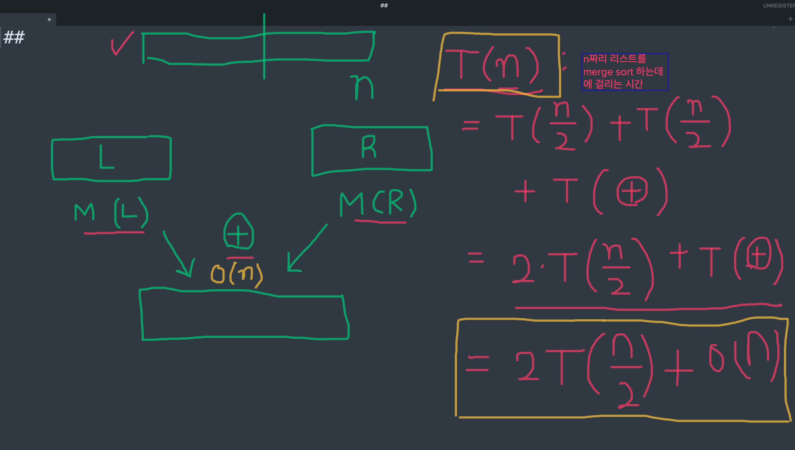
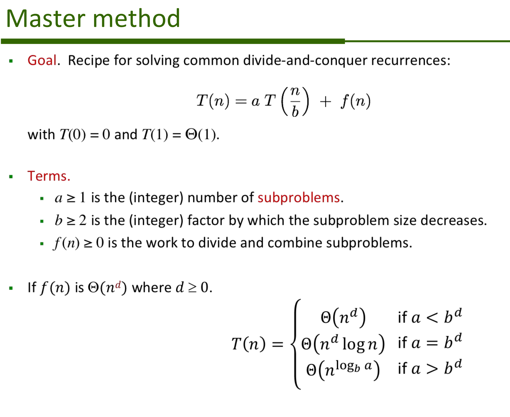
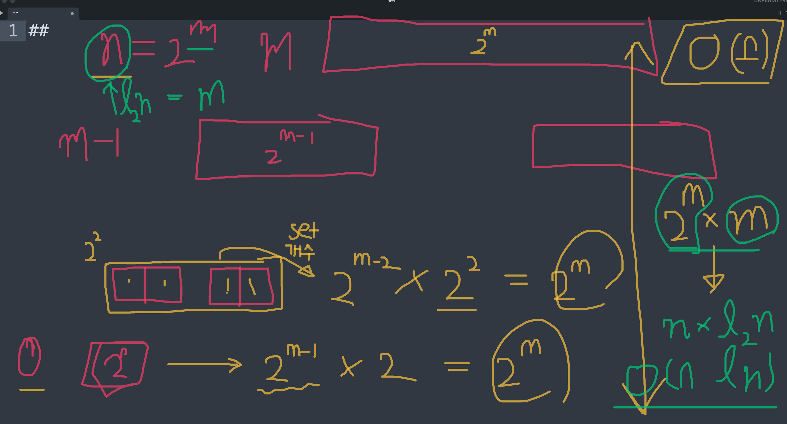

## Day 09

- Stack
- 행렬 (리스트로 표현)
- DFS
- Merge Sort의 Time Complexity

## Stack

### Stack 이란?
- list 의 한 종류
- 그러나 일반 list와 다르게 원소를 넣고 뺄 때 그 행위들이 제한적임 (LIFO)
    - 원소를 넣을 때는 가장 마지막에 넣고 (Last in -> LI) 
    - 원소를 뺄 때는 가장 마지막에 들어온 원소를 먼저 뺀다 (First out -> FO) 

### Stack 구현
- Class 의 구성요소
    - attribute
        - store: 리스트. 원소들을 보관.
    - function
        - push: 원소를 추가
          - 인풋 원소를 store 의 마지막에 넣는다
        - pop: 원소를 뺀다
          - 가장 마지막에 있는 원소를 리턴한다
          - store 는 마지막 원소가 없는 버전으로 업데이트됨
    
- 코드

    ```python
    class Stack:
        def __init__(self):
            self.store = []
        def push(self, e):
            self.store.append(e)
        def pop(self):
            if len(self.store) == 0:
                return None
            last = self.store[-1]
            self.store = self.store[:-1]
            return last


## 행렬

- List 로 행렬을 표현할 수 있다. row value들의 리스트로 표현하며, 각 row value 도 값들을 리스트로 저장한다.

  - 행렬 = `[ row1, row2, row3, ...]`
  - 이 때 `row1 = [?, ?, ?, ...]`, `row2 = [?, ?, ?, ...]`

- 예)

  ```
  10 20
  30 40
  ```

  처럼 생긴 행렬은

  ```
  [[10, 20],
   [30, 40]]
  ```

  과 같이 표현한다. 한줄로 쓰면 아래와 같다.

  ```
  [[10, 20], [30, 40]]
  ```

- 특정 위치 (특정 row와 column) 의 값 얻기

  - 리스트의 indexing 을 통해 행렬의 특정 row와 column에 위치한 값을 얻을 수 있다.
  - `행렬[row][col]`
    - `행렬[row]` 를 통해 먼저 row value들을 얻는다. 이 row value들은 해당 row 에 위치한 모든 column 값들을 가지고 있는 리스트이다.
    - `행렬[row][col]`: `행렬[row]`에서 얻은 column value들 중에서, 내가 원하는 특정 col 값을 indexing을 통해 얻는다.

## Merge Sort 의 Time complexity

- Merge sort의 Time complexity는 O(n log n) 으로 알려져 있다. 왜 그럴까?

- 방법 1) Master method 사용

  - T(n) = n짜리 리스트를 merge sort 하는데 걸리는 시간이라고 하자.
    - 그러면 아래와 같이 T(n) = 2 * T(n/2) + O(n) 의 점화식을 구할 수 있다.

  

  - Master method 를 사용하여 T(n) 을 구해보자. 우선 Master method 는 다음과 같다.

    

    - Merge sort 의 점화식은 `T(n) = 2 * T(n/2) + O(n)` 였으니, 공식에 대입하면
      - a = 2
      - b = 2
      - f(n) = O(n), 즉, d = 1
      - a = 2 = b<sup>d</sup> = 2<sup>1</sup> = 2 이므로 저 세 개의 case 중에 두번 째 case
      - 따라서, T(n) = O(n<sup>1</sup> log n) = O(n log n)

- 방법 2) 직접 알고리즘을 따라가면서 Time complexity 확인

  


