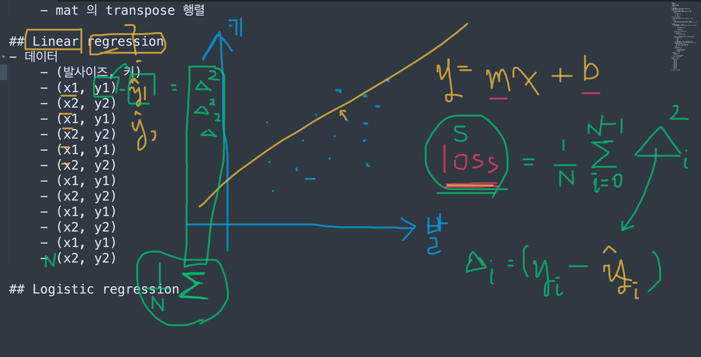
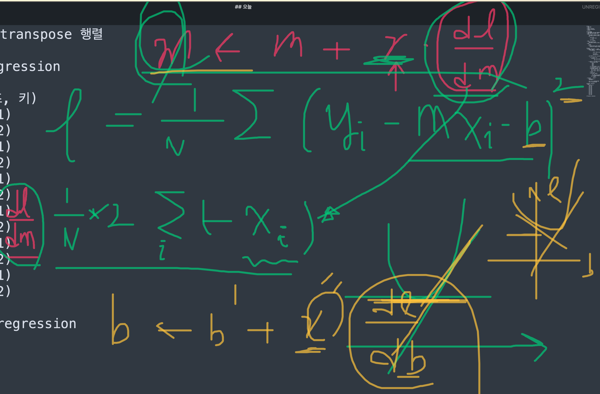

## Day 12

- 스트링 포맷팅
- numpy array 초기화
- linear regression
- logistic regression

## String formatting

### String formatting 이란?

- String formatting 이란 내가 원하는 특정 format 의 string 을 만드는 행위이며, 이 때 format 에는 변수가 들어갈 수 있다.
- 오늘은 총 두 가지 버전을 배운다
  - 버전1: `%-formatting`
  - 버전2: `'{}'.format()`

### %-formatting

- 포맷 만들기

  - 스트링 안에 변수가 들어갈 자리에 `%` + `데이터타입 inicator` 를 넣어준다. 생긴건 다음과 같이 생겼다.
    - `"포맷 어쩌고 저쩌고... %? 어쩌고 %? 저쩌고 %?"`
    - `%?` 에서 `?` 부분은 해당 변수의 데이터타입에 맞는 것을 넣어준다.
  - 변수의 데이터타입
    - %d - 정수 
    - %f - 실수 (float)
      - %.?f
        - 여기서 ? 부분에 숫자를 넣을 수 있음. 그러면 소숫점 `?`째 자리까지만 넣는다는 의미가 됨.
        - 예) `%.2f` 소숫점 둘째자리까지 반올림한 값으로 포맷됨
    - %s - str
    - %r - boolean
  - 예) `"The value of pi is %.3f"`

- 포맷 안 변수에 값 넣기

  - %로 표현된 변수들에 넣을 값들을 차례로 tuple 에 넣고, `포맷 % 값들` 형식으로 작성하면 됨.

  - 예)

    ```python
    my_str = "The value of %s is %.3f." % ('pi', 3.141592)
    print(my_str)
    ```

    실행 결과

    ```
    The value of pi is 3.142.
    ```

- %-formatting 은 과거 C 언어에서 사용하는 스트링 포맷팅방식이다. 오래되었단 뜻이다. 데이터타입을 확실하게 정해주어야하는 귀찮음이 있다.


### format 함수를 사용한 string formatting

- %-formatting과 달리, 변수의 데이터타입을 굳이 결정해주지 않아도 된다는 점에서 좀 더 자유롭다.

- 포맷 만들기

  - 변수 부분에 % 어쩌고 할 필요 없이, 그냥 `{}`로 뻥뻥 뚫어주면 된다.

  - 예) 

    %-formatting

    ```
    "The value of %s is %.3f."
    ```

    {}.format

    ```
    "The value of {} is {}."
    ```

- 값 넣기

  - 변수에 들어갈 값을 format 함수의 인풋으로 차례대로 넣어주면 된다. 포맷스트링 옆에 점(.)을 찍고 format 함수를 콜해준다.

  - 예)

    ```python
    my_str = "The value of {} is {}.".format('pi', 3.141592)
    print(my_str)
    ```

    실행 결과

    ```
    The value of pi is 3.141592.
    ```

- 만약 %-formatting 에서 했던 것처럼, 데이터타입을 특정하게 주거나 섬세한(?) 숫자의 포맷팅을 하고싶으면 중괄호 `{}` 안에 %대신 콜론`:` 을 넣고 데이터타입을 명시해주면 된다.

  - 예)

    ```python
    my_str = "The value of {} is {:.2f}.".format('pi', 3.141592)
    print(my_str)
    ```

    실행 결과

    ```
    The value of pi is 3.14.
    ```


## Numpy array 초기화

- Numpy array 를 초기화하는 방법은 많지만, 우리는 그 중에서 네 가지 방법을 배운다. 첫 번째 방법은 저번시간 (Day 11) 의 내용을 복붙 하였다.
  - List 를 np.array로 형변환하기 (Day 11 복붙함)
  - 0으로 채워진 np.array 만들기
  - 1로 채워진 np.array 만들기
  - 랜덤 숫자로 채워진 np.array 만들기

### List 를 np.array 로 형변환

- `np.array(어떤 list)`: list를 numpy array로 형변환

- 예)

  ```python
  import numpy as np
  
  vec1 = np.array([1, 2, 3, 4])
  print(vec1)
  ```

  실행 결과

  ```
  [1 2 3 4]
  ```

  

### 0으로 채워진 np.array 만들기

- `np.zeros(shape)`: 0으로 채워진 shape 모양의 np.array를 생성

- 예)

  ```python
  import numpy as np
  
  zero_vec = np.zeros(3)
  zero_mat = np.zeros((3, 4))
  
  print(zero_vec)
  print()
  print(zero_mat)
  ```

  실행 결과

  ```
  [0. 0. 0.]
  
  [[0. 0. 0. 0.]
   [0. 0. 0. 0.]
   [0. 0. 0. 0.]]
  ```

  

### 1로 채워진 np.array 만들기

- `np.ones(shape)`: 1로 채워진 shape 모양의 np.array를 생성

- 예)

  ```python
  import numpy as np
  
  one_vec = np.ones(3)
  one_mat = np.ones((3, 4))
  
  print(one_vec)
  print()
  print(one_mat)
  ```

  실행 결과

  ```
  [1. 1. 1.]
  
  [[1. 1. 1. 1.]
   [1. 1. 1. 1.]
   [1. 1. 1. 1.]]
  ```


### 랜덤 숫자로 채워진 np.array 만들기

- `np.random.random(shape)`: 0~1 사이의 랜덤숫자로 채워진 shape 모양의 np.array 를 생성

- 예)

  ```python
  import numpy as np
  
  rand_vec = np.random.random(3)
  rand_mat = np.random.random((3, 4))
  
  print(rand_vec)
  print()
  print(rand_mat)
  ```

  실행 결과

  ```
  [0.33645688 0.05951156 0.89385473]
  
  [[0.84546055 0.06373179 0.24960849 0.15001499]
   [0.35884222 0.05132274 0.49094566 0.40594175]
   [0.08820151 0.52115029 0.6779572  0.00757405]]
  ```

  

## Linear regression (추후 업데이트 예정)

- Linear regression 은 데이터와 정답값이 있을 때, 데이터가 정답과 어떤 (선형) 관계가 있을지 파악하고싶을 때 사용





## Logistic regression (추후 업데이트 예정)

- Logistic regression 은 classification task에서 주로 사용됨.
- output이 연속된 값을 갖는 것이 아닌, 0 또는 1의 값을 갖는 binary classification task가 있을 때, 어떤 변수 x 가 1로 classification 될 "확률" 을 구하는 것에 집중함